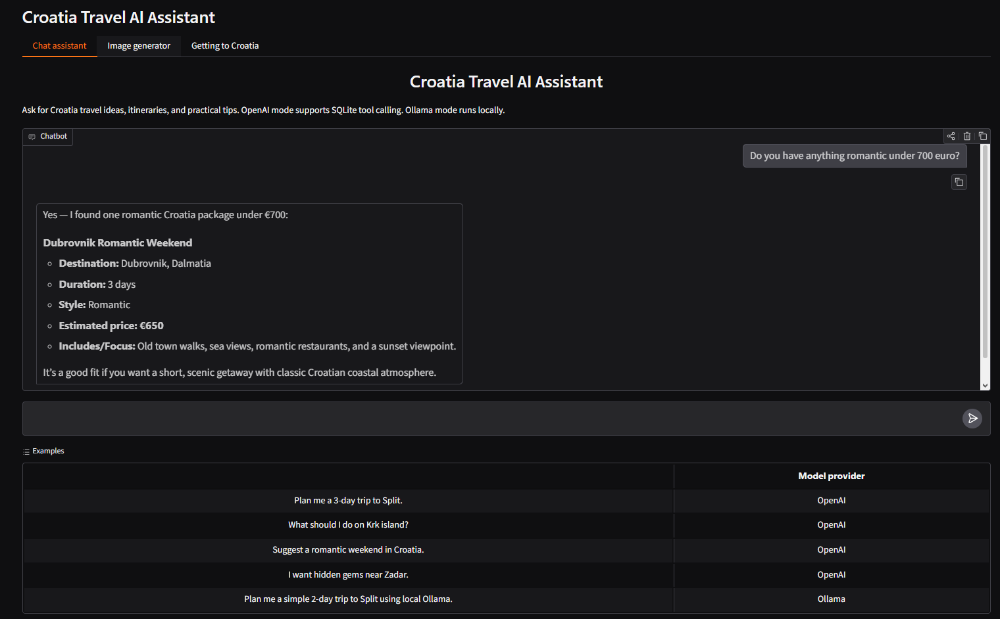
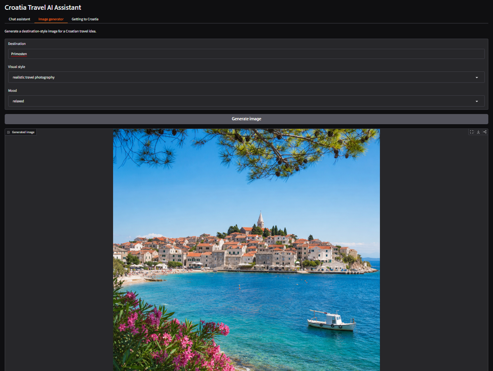
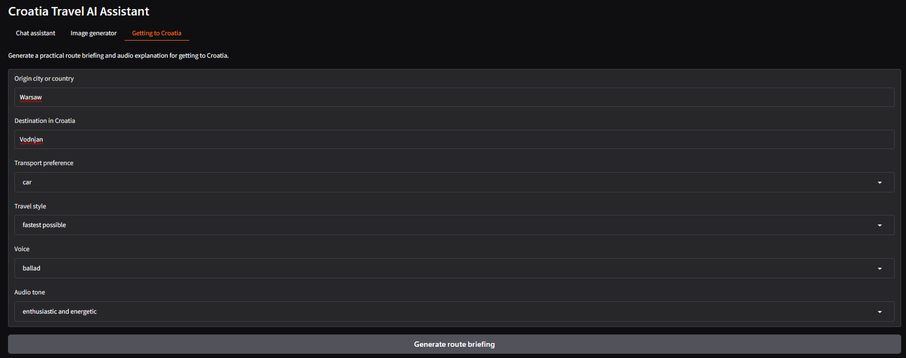

# Croatia Travel AI Assistant


Croatia Travel AI Assistant is a portfolio project for practicing LLM application development with Python.

The app helps users plan trips to Croatia using an AI assistant, a local SQLite database, OpenAI tool calling, image generation, and audio route briefings.

## What this project demonstrates

This project demonstrates practical LLM application development, including:

* building a multi-tab Gradio app
* using OpenAI API for chat, image generation, and text-to-speech
* adding local Ollama model support
* connecting an LLM to SQLite data through tool calling
* managing a Python project with uv
* writing basic tests with pytest
* running automated tests with GitHub Actions

## Live demo

The app is deployed on Hugging Face Spaces:

[Open Croatia Travel AI Assistant](https://huggingface.co/spaces/PatrykGluszekDS/croatia-travel-ai-assistant)

## Public demo mode

The Hugging Face Space is configured as a public demo version of the app.

To control OpenAI API usage, some expensive features may be limited in the deployed version:

* image generation may be disabled
* audio generation may be disabled or limited
* route briefing may return text without audio
* OpenAI responses may be kept shorter

The full version can still be run locally with your own OpenAI API key.

This behavior can be controlled with the `DEMO_MODE` environment variable:

```text
DEMO_MODE=true
```

For local development, `DEMO_MODE` can be omitted or set to:

```text
DEMO_MODE=false
```


## Features

### Chat assistant

The main chatbot helps users with Croatia travel planning. It can suggest destinations, itineraries, travel styles, and practical tips.

The chat supports conversation history, so the assistant can remember previous messages during the current session.

### OpenAI and Ollama model providers

The chat assistant supports two model providers:

- **OpenAI** — cloud model with SQLite tool calling support
- **Ollama** — local model running on the user's machine

OpenAI mode can use the SQLite database through tool calling. Ollama mode is used for local text generation and does not use the database tools.

### SQLite travel database

The project includes a local SQLite database with sample Croatia travel data.

The database uses a small relational schema with tables for:

- destinations
- travel packages
- activities
- transport options

The assistant can use OpenAI tool calling to search packages, explain destinations, suggest activities, and provide general transport guidance.

### OpenAI tool calling

The assistant uses OpenAI tool calling to decide when it should access the SQLite database.

For example, when the user asks:

```text
Do you have anything romantic?
```

the model can call a Python tool that searches the local database for romantic travel packages.

This demonstrates how an LLM can work together with external structured data.

### Image generation

The app includes a destination image generation tab.

The user can choose:

- destination
- visual style
- mood

The app then generates a travel-style image for the selected Croatian destination.

### Getting to Croatia route briefing

The app includes a route briefing feature that helps users understand how they could travel from their origin city or country to a destination in Croatia.

The user can provide:

- origin city or country
- destination in Croatia
- transport preference
- travel style
- voice
- audio tone

The app generates:

- a written route briefing
- an audio version of the briefing

The route briefing is intended as general travel guidance and does not provide live timetables, ticket prices, or real-time availability.

## Screenshots

### Chat assistant

The chat assistant can answer Croatia travel questions and use SQLite-backed OpenAI tool calling to search local travel package data.



### Image generator

The image generator creates travel-style visuals for Croatian destinations based on destination, style, and mood.



### Getting to Croatia route briefing

The route briefing tab generates a practical written route plan and an audio narration for traveling from an origin city or country to Croatia.



## Tech stack

- Python
- OpenAI API
- Gradio
- Ollama
- SQLite
- uv
- python-dotenv

## Project structure

```text
croatia-travel-ai-assistant/
├── app.py
├── database.py
├── tools.py
├── image_generation.py
├── route_planner.py
├── README.md
├── pyproject.toml
├── uv.lock
├── .env.example
├── .gitignore
├── data/
│   └── croatia_travel.db        # generated locally, not committed
├── generated_images/            # generated locally, not committed
└── generated_audio/             # generated locally, not committed
```

## Deployment notes

The app can be run locally with uv or Docker.

The Docker version is useful for deployment and can be used on platforms such as Hugging Face Spaces.

In deployed environments, OpenAI features require `OPENAI_API_KEY` to be configured as an environment variable or secret.

The public Hugging Face demo can use `DEMO_MODE=true` to limit expensive API features and protect OpenAI credits.

Ollama mode is intended for local use. It requires Ollama to be installed and running on the user's machine, so it may not be available in hosted deployments.


## Prerequisites

To run the full project locally, you need:

* Python
* uv
* an OpenAI API key
* Ollama installed locally, only if you want to use the Ollama chat provider

The OpenAI features require a valid `OPENAI_API_KEY`. Image generation and text-to-speech availability may depend on the models available for your OpenAI account.


## Setup

Clone the repository:

```bash
git clone https://github.com/PatrykGluszekDS/croatia-travel-ai-assistant.git
cd croatia-travel-ai-assistant
```

Install dependencies with uv:

```bash
uv sync
```

Create a `.env` file in the project root:

```text
OPENAI_API_KEY=your_openai_api_key_here
```

Initialize the SQLite database:

```bash
uv run database.py
```

Run the Gradio app:

```bash
uv run app.py
```

Then open the local Gradio URL shown in the terminal.

## Optional: Ollama setup

To use the local Ollama chat provider, install and run Ollama on your machine.

Pull the local model used by the app:

```bash
ollama pull llama3.2:1b
```

## Environment and dependency management

This project uses `uv` for Python environment and dependency management.

Important files:

- `pyproject.toml` contains project metadata and dependencies.
- `uv.lock` stores exact resolved package versions.
- `.venv/` is the local virtual environment and is not committed.
- `.env` stores private API keys and is not committed.
- `.env.example` shows which environment variables are required.

## Generated files

The following outputs are generated locally and are not committed to GitHub:

- SQLite database file: `data/croatia_travel.db`
- generated images: `generated_images/`
- generated audio files: `generated_audio/`

They are ignored because they are generated outputs, can grow large, and may contain private or temporary data.

## Example use cases

The assistant can answer questions such as:

```text
Do you have a package for Split?
```

```text
Show me packages under 500 euro.
```

```text
Do you have anything romantic?
```

```text
I want something in Dalmatia for 3 days.
```

The image generator can create travel-style visuals such as:

```text
Destination: Dubrovnik
Style: vintage travel poster
Mood: romantic
```

The route briefing tab can generate advice such as:

```text
Origin: Warsaw, Poland
Destination: Split
Transport preference: flexible / best overall option
Travel style: balanced
```

## Running tests

This project includes basic tests for the SQLite database and tool-calling logic.

Run tests with:

```bash
uv run pytest
```

## Current limitations

- The database contains sample travel packages, not real commercial offers.
- The route planner does not use live flight, train, bus, ferry, or traffic APIs.
- Prices and travel times should be treated as approximate unless verified with current sources.
- Generated images and audio are stored locally and ignored by Git.
- Ollama mode currently supports local chat only and does not use SQLite tool calling.
- The quality of Ollama responses depends on the local model. The default `llama3.2:1b` model is lightweight but weaker than larger models.
- The public Hugging Face demo may run in demo mode, so image generation or audio generation can be limited to control API usage.

## Possible improvements

- Add more realistic travel package data
- Add saved user preferences
- Add tool calling support for Ollama mode
- Add external APIs for live transport information
- Add deployment instructions
- Refactor the app into a larger package structure
- Add more destinations, activities, and transport options
- Add richer seasonal and budget information